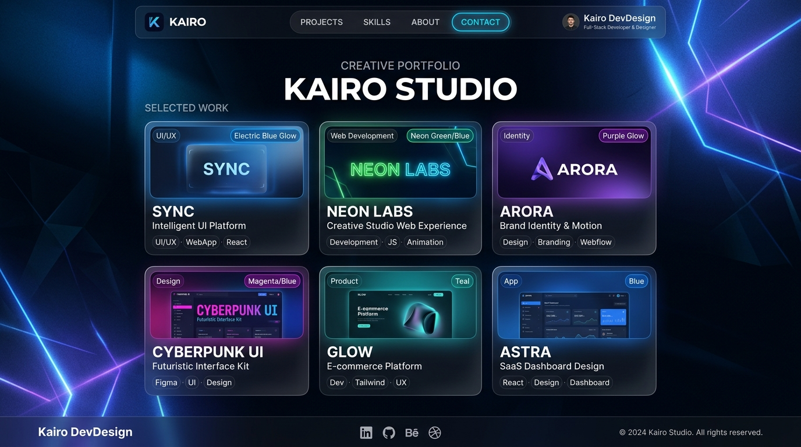

# Mohamed Arafa — Personal Portfolio Website

A complete, modern, high-performance, and accessible personal portfolio website built for **Mohamed Arafa**, Full-Stack Developer. Designed for LinkedIn-like professional exposure, recruiter engagement, and freelance opportunities.



---

## ⚡ Tech Stack

* **HTML5**: Semantic elements (`<header>`, `<nav>`, `<main>`, `<section>`, `<article>`, `<footer>`), OpenGraph metadata, WCAG accessibility.
* **CSS3**: Vanilla CSS with custom design tokens, dark navy & electric blue palette, responsive CSS Grid & Flexbox, subtle glassmorphism, and `prefers-reduced-motion` compliance.
* **TypeScript**: Type-safe vanilla TypeScript (`src/script.ts` compiling to `dist/script.js`), controlling mobile navigation, dynamic testimonial rating interaction, and horizontal project showcase controls.
* **No Frameworks or Heavy UI Libraries**: Zero runtime overhead, ultra-fast load time, and pristine code maintainability.

---

## 📁 Project Structure

```text
mohamed-portfolio/
│
├── index.html              # Main semantic HTML5 document
│
├── css/
│   └── styles.css          # Vanilla CSS design system & responsive styling
│
├── src/
│   └── script.ts           # Source TypeScript file
│
├── dist/
│   └── script.js           # Compiled JavaScript loaded by index.html
│
├── assets/
│   ├── profile.jpg         # Profile portrait photo
│   ├── about.jpg           # Developer workspace setup image
│   │
│   └── projects/           # High-resolution project showcase mockups
│       ├── project-1.jpg   # E-Commerce Platform
│       ├── project-2.jpg   # Learning Platform
│       ├── project-3.jpg   # Business Dashboard
│       ├── project-4.jpg   # Creative Portfolio
│       ├── project-5.jpg   # Booking System
│       └── project-6.jpg   # Task Manager
│
├── package.json            # Project dev scripts and dependencies
├── tsconfig.json           # TypeScript configuration
└── README.md               # Project documentation & setup guide
```

---

## 🚀 Local Development

### 1. Install TypeScript

```bash
npm install -D typescript
```

### 2. Compile TypeScript

Compile the TypeScript source code (`src/script.ts`) into the output JavaScript bundle (`dist/script.js`):

```bash
npx tsc
```

### 3. Watch Mode

To automatically recompile whenever you edit `src/script.ts`:

```bash
npx tsc --watch
```

### 4. Run the Website Locally

You can open `index.html` directly in any modern web browser or use a static development server:

#### Option A: Using `serve`
```bash
npx serve .
```

#### Option B: Using VS Code Live Server
Right-click on `index.html` in VS Code and select **"Open with Live Server"**.

The browser will load `index.html`, and TypeScript will compile `src/script.ts` into `dist/script.js`.

---

## 🎨 Design & Accessibility Features

* **Dark Navy & Electric Blue Palette**: Deep blue surfaces (`#070c18`, `#101c36`) paired with vibrant electric blue accents (`#0066ff`, `#38bdf8`).
* **9 Sections in Structured Sequence**:
  1. **Home**: Hero section with greeting, title, description, live pulsing status badge, and glowing profile portrait.
  2. **About**: Two-column layout with workspace visual, narrative, and 4 highlight statistics cards.
  3. **Education**: Zagazig University, Faculty of Science, Computer Science department card.
  4. **Skills**: 12 responsive skill cards with SVG icons, descriptions, and sleek elevation on hover.
  5. **Projects**: Horizontally scrollable showcase (showing ~3 cards on desktop, 1 on mobile) with Prev/Next buttons and smooth scroll snap.
  6. **Testimonials**: Interactive testimonial card with live TypeScript 1-to-5 star rating switcher, `aria-live` region, and rating button.
  7. **Services**: 6 specialized full-stack service cards.
  8. **Get In Touch**: Contact cards for Email, LinkedIn, GitHub, and Phone with secure `target="_blank"` attributes.
  9. **Footer**: Navigation links, copyright notice, and back-to-top button.
* **WCAG Compliance**:
  - Full keyboard accessibility (Tab, Enter, Space, Escape to close mobile menu).
  - High-contrast `:focus-visible` rings.
  - Screen-reader friendly `aria-expanded`, `aria-controls`, `aria-live="polite"`.
  - Native `prefers-reduced-motion` support.

---

## 🛠️ Personalization Guide

To personalize this portfolio with your real information:
1. **Contact Information**: In `index.html`, replace:
   - `YOUR_EMAIL` with your real email address.
   - `YOUR_USERNAME` with your LinkedIn and GitHub usernames.
   - `+20XXXXXXXXXX` with your phone number.
2. **Profile Photo**: Replace `assets/profile.jpg` with your own square headshot.
3. **Projects**: Replace project titles, descriptions, and URLs with your own active project links.

---

## 📄 License

This project is licensed under the MIT License — feel free to customize and use it for your personal portfolio.
"# portfolio" 
"# portfolio" 
